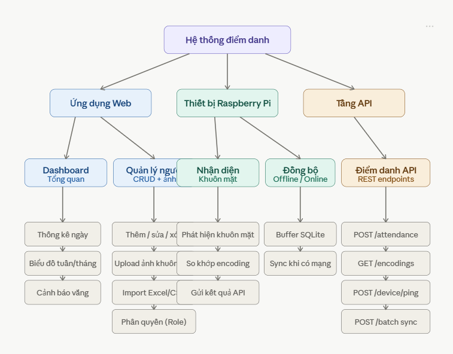
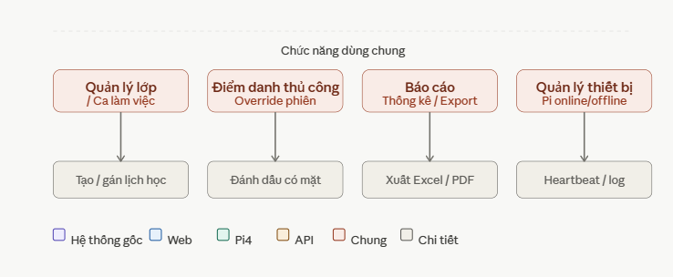
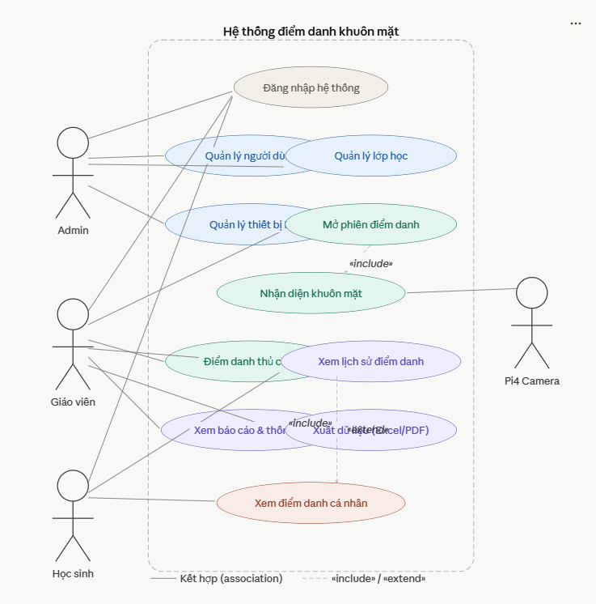

# Đề Xuất Tổng Quan Hệ Thống Điểm Danh Bằng Nhận Diện Khuôn Mặt

> **Đề tài:** Hệ thống điểm danh tự động sử dụng Raspberry Pi 4 và camera nhận diện khuôn mặt, tích hợp giao diện web quản lý.

---

## 1. Mục Tiêu Hệ Thống

- Tự động nhận diện khuôn mặt và ghi nhận điểm danh theo thời gian thực
- Cung cấp giao diện web để quản lý người dùng, lớp học, và dữ liệu điểm danh
- Hỗ trợ báo cáo thống kê, xuất dữ liệu và phân quyền người dùng
- Đảm bảo hệ thống hoạt động ổn định, bảo mật và có khả năng mở rộng

---

## 2. Kiến Trúc Tổng Quan

```
┌─────────────────────────────────────────────────────────────┐
│                        CLIENT LAYER                         │
│          Browser (Admin / Giáo viên / Học sinh)             │
└────────────────────────┬────────────────────────────────────┘
                         │ HTTP / WebSocket
┌────────────────────────▼────────────────────────────────────┐
│                      WEB APPLICATION                        │
│                  Laravel (PHP Framework)                    │
│   - REST API          - Blade Views         - Auth/ACL      │
│   - Queue Jobs        - WebSocket Server    - File Upload   │
└────────┬──────────────────────────────┬─────────────────────┘
         │ Eloquent ORM                 │ REST API (JSON)
┌────────▼───────────┐       ┌──────────▼───────────────────┐
│    MySQL Database  │       │      Raspberry Pi 4           │
│  - users           │       │  Python + OpenCV              │
│  - attendances     │       │  face_recognition library     │
│  - classes         │       │  Camera Module v2             │
│  - sessions        │       │  Auto-sync khi có mạng        │
│  - face_encodings  │       └──────────────────────────────┘
└────────────────────┘
```

---

## 3. Stack Công Nghệ

### 3.1 Backend (Web Server)

| Thành phần | Công nghệ | Lý do chọn |
|---|---|---|
| Framework | Laravel 11 | Ecosystem phong phú, có Breeze/Sanctum sẵn |
| Ngôn ngữ | PHP 8.2+ | Hỗ trợ tốt các tính năng OOP hiện đại |
| Database | MySQL 8.0 | Ổn định, dễ quản lý, phù hợp dữ liệu quan hệ |
| Queue | Laravel Queue (database driver) | Xử lý tác vụ nền — không cần Redis cho basic |
| Real-time | Polling mỗi 10 giây | Đủ dùng cho ~50 người, không cần WebSocket |
| Auth Web | Laravel Breeze | Có sẵn login/register, đơn giản |
| Auth API (Pi) | Laravel Sanctum (token) | Token-based cho thiết bị Pi |
| Storage | Laravel Storage (local) | Lưu ảnh khuôn mặt trên server |

### 3.2 Frontend (Giao diện Web)

| Thành phần | Công nghệ |
|---|---|
| Template engine | Blade (Laravel) |
| CSS Framework | TailwindCSS |
| JS Framework | Alpine.js |
| Charts | Chart.js |
| DataTable | DataTables.js |
| Icons | Heroicons |

### 3.3 Raspberry Pi 4 (Edge Device)

| Thành phần | Công nghệ |
|---|---|
| Ngôn ngữ | Python 3.9+ |
| Nhận diện khuôn mặt | `face_recognition` (dlib) + OpenCV |
| Camera | Raspberry Pi Camera Module v2 / USB Camera |
| Giao tiếp server | `requests` (HTTP POST lên Laravel API) |
| Lưu trữ cục bộ | SQLite (offline buffer khi mất mạng) |
| Màn hình (tuỳ chọn) | HDMI display hiển thị kết quả nhận diện |

---

## 4. Các Module Chức Năng

### 4.1 Dashboard (Trang Tổng Quan)
- Thống kê tổng số nhân viên, số phòng ban, số lượt chấm công trong ngày
- Biểu đồ chấm công theo tuần/tháng
- Danh sách check-in/check-out gần đây (real-time)
- Cảnh báo: thiết bị Pi offline, nhân viên chưa check-in, tỉ lệ vắng cao

### 4.2 Quản Lý Nhân Viên
- **CRUD:** Thêm, sửa, xóa nhân viên (soft delete — không mất dữ liệu chấm công)
- **Upload ảnh khuôn mặt:** Tải lên ảnh qua web, server tự mã hóa face encoding
- **Import từ Excel/CSV:** Nhập hàng loạt
- **Tìm kiếm & lọc:** Theo tên, mã nhân viên, phòng ban, trạng thái

### 4.3 Quản Lý Phòng Ban
- Tạo, sửa, xóa phòng ban
- Gán nhân viên vào phòng ban (mỗi nhân viên thuộc 1 phòng ban)
- Thiết lập giờ làm việc riêng: giờ vào (`check_in_time`), giờ ra (`check_out_time`), biên độ trễ (`late_tolerance` phút)
- Gán quản lý phòng ban

### 4.4 Chấm Công & Lịch Sử
- Xem lịch sử theo ngày, tuần, tháng
- Lọc theo: nhân viên, phòng ban, trạng thái (đúng giờ / trễ / về sớm / vắng / nghỉ phép)
- Xem chi tiết: giờ check-in, giờ check-out, độ chính xác nhận diện, ảnh chụp
- Override thủ công: Admin/Manager sửa trạng thái, ghi chú lý do
- Xuất dữ liệu: Excel, PDF, CSV

### 4.5 Báo Cáo & Thống Kê
- Tỉ lệ chấm công theo từng nhân viên / phòng ban / khoảng thời gian
- Xếp hạng tỉ lệ vắng mặt, đi trễ
- Báo cáo tổng kết tháng
- Gửi báo cáo qua email tự động (Queue)

### 4.6 Quản Lý Thiết Bị Pi
- Thông tin thiết bị (tên, vị trí)
- Trạng thái online/offline (heartbeat API)
- Log nhận diện từ thiết bị
- Đồng bộ face encodings xuống Pi (delta sync theo `updated_since`)

### 4.7 Phân Quyền (Role & Permission)
| Role | Quyền |
|---|---|
| Super Admin | Toàn quyền hệ thống |
| Admin (HR) | Quản lý nhân viên, phòng ban, thiết bị, xem tất cả chấm công |
| Manager | Xem & override chấm công phòng ban của mình |
| Employee | Xem lịch sử chấm công cá nhân |

---

## 5. Luồng Hoạt Động Chính

### 5.1 Luồng Check-in / Check-out Tự Động

```
[Camera Pi4] → Chụp frame liên tục (resize 1/4 để tăng tốc)
      ↓
[Python] → Phát hiện khuôn mặt (face_detection)
      ↓
[Python] → So sánh face encoding với danh sách cục bộ
      ↓
[Nhận diện thành công, confidence ≥ 85%]
      ↓
[Python] → Kiểm tra cooldown: cùng user_id không ghi 2 lần trong 5 phút
      ↓
[Python] → POST /api/attendance với {user_id, type (check_in|check_out), confidence, image}
      ↓
[Laravel API] → Xác thực token Pi → Xác định trạng thái (đúng giờ/trễ/về sớm)
               dựa vào giờ làm việc của phòng ban → Lưu DB → Broadcast WebSocket
      ↓
[Web Client] → Cập nhật real-time không cần refresh
```

### 5.2 Luồng Thêm Nhân Viên Kèm Ảnh

```
[Admin Web] → Upload ảnh khuôn mặt
      ↓
[Laravel] → Lưu ảnh → Dispatch Queue Job (không block request)
      ↓
[Queue Worker] → Gọi Python script mã hóa face encoding
      ↓
[Python script] → Trả về encoding vector (128 chiều)
      ↓
[Laravel] → Lưu encoding vào DB
      ↓
[Pi lần sau GET /api/encodings?updated_since=...] → Tải xuống encoding mới
```

### 5.3 Luồng Offline (Mất kết nối mạng)

```
[Pi4 mất mạng] → Tiếp tục nhận diện bình thường
      ↓
[Python] → Lưu kết quả vào SQLite local
      ↓
[Khi có mạng trở lại] → POST /api/attendance/batch
      ↓
[Laravel] → Xử lý duplicate theo (user_id + work_date + type), lưu DB, cập nhật UI
```

---

## 6. Thiết Kế Cơ Sở Dữ Liệu (Sơ lược)

```
users            → id, name, email, code, password, role, department_id (FK),
                   avatar, created_at, updated_at, deleted_at

departments      → id, name, description, manager_id (FK → users),
                   check_in_time, check_out_time, late_tolerance (phút),
                   created_at, updated_at

face_encodings   → id, user_id (FK), encoding (JSON), image_path, created_at

attendances      → id, user_id (FK), device_id (FK), work_date,
                   check_in_at, check_in_confidence, check_in_image,
                   check_out_at, check_out_confidence, check_out_image,
                   status (present|late|early_leave|absent|leave),
                   note, created_at, updated_at

devices          → id, name, location, token, last_ping,
                   status (online|offline), created_at, updated_at
```

**Lưu ý thiết kế:**
- `users.deleted_at`: soft delete — xóa nhân viên không mất lịch sử chấm công
- `departments.check_in_time / check_out_time`: mỗi phòng ban có giờ làm riêng
- `departments.late_tolerance`: biên độ trễ (ví dụ 15 phút), server tự tính status
- `attendances.work_date`: unique per (user_id, work_date) — 1 nhân viên 1 bản ghi/ngày
- `attendances` có cả check-in và check-out trong cùng 1 record

---

## 7. API Endpoints (Pi4 ↔ Laravel)

| Method | Endpoint | Mô tả |
|---|---|---|
| POST | `/api/auth/device` | Pi đăng nhập lấy token |
| GET | `/api/encodings?updated_since={timestamp}` | Pi tải face encodings mới (delta sync) |
| POST | `/api/attendance` | Pi gửi 1 lượt check-in hoặc check-out |
| POST | `/api/device/ping` | Heartbeat kiểm tra online |
| POST | `/api/attendance/batch` | Sync hàng loạt khi offline |

**Body của `POST /api/attendance`:**
```json
{
  "user_id": 5,
  "type": "check_in",
  "confidence": 0.92,
  "image": "<base64>",
  "recorded_at": "2025-05-03T08:05:00"
}
```

---

## 8. Bảo Mật

- **API Authentication:** Laravel Sanctum (token-based cho Pi)
- **Web Authentication:** Laravel Auth + Session
- **HTTPS:** Bắt buộc trên môi trường production (VPS + SSL)
- **Rate Limiting:** Giới hạn request từ Pi tránh spam
- **Input Validation:** Validate toàn bộ dữ liệu đầu vào
- **Image Upload:** Kiểm tra định dạng, giới hạn kích thước, lưu ngoài public dir

---

## 9. Môi Trường Triển Khai

### Development
- Local machine + Laravel Sail (Docker)
- Pi4 kết nối qua mạng LAN

### Production
- **VPS:** Ubuntu 22.04, Nginx, PHP-FPM, MySQL, Redis
- **Domain:** HTTPS với Let's Encrypt
- **Pi4:** Kết nối qua IP tĩnh hoặc DDNS

---

## 10. Kế Hoạch Phát Triển Theo Giai Đoạn

| Giai đoạn | Nội dung | Thời gian dự kiến |
|---|---|---|
| Phase 1 | Thiết kế DB, Auth, CRUD người dùng, upload ảnh | Tuần 1-2 |
| Phase 2 | API cho Pi4, module điểm danh, real-time | Tuần 3-4 |
| Phase 3 | Báo cáo, thống kê, export Excel/PDF | Tuần 5 |
| Phase 4 | Phân quyền, quản lý thiết bị, UI hoàn thiện | Tuần 6 |
| Phase 5 | Testing, deploy VPS, viết tài liệu | Tuần 7-8 |

---

## 11. Các Rủi Ro & Giải Pháp

| Rủi ro | Giải pháp |
|---|---|
| Ánh sáng kém ảnh hưởng nhận diện | Cải thiện lighting, dùng IR camera |
| Pi4 mất mạng | Offline buffer với SQLite |
| Nhận diện nhầm (false positive) | Đặt ngưỡng confidence tối thiểu (ví dụ ≥ 85%) |
| Dữ liệu ảnh lớn | Nén ảnh, chỉ lưu thumbnail + encoding vector |
| Hiệu năng Pi4 thấp | Giảm độ phân giải frame, dùng `face_recognition` với model `small` |

---

*Tài liệu này là cơ sở để triển khai từng phần theo yêu cầu. Các mục có thể điều chỉnh theo tiến độ và phản hồi thực tế.*

## SƠ ĐỒ CHỨC NĂNG



## SƠ ĐỒ USECASE


##  SEQUENCE


##  activity


##  CLASS
