# Sơ Đồ Chức Năng Tổng Quát
## Hệ Thống Điểm Danh Bằng Nhận Diện Khuôn Mặt

---

## Sơ đồ chức năng (Mermaid)

```mermaid
flowchart TD
    ROOT["🖥️ Hệ thống điểm danh\nkhuôn mặt"]

    ROOT --> WEB["🌐 Ứng dụng Web\n(Laravel)"]
    ROOT --> PI["📷 Thiết bị Raspberry Pi 4\n(Python + OpenCV)"]
    ROOT --> API["⚙️ Tầng API\n(REST - Laravel Sanctum)"]

    %% ── WEB ──────────────────────────────────
    WEB --> DASH["Dashboard\nTổng quan hệ thống"]
    WEB --> USER["Quản lý người dùng\nCRUD + upload ảnh"]
    WEB --> CLASS["Quản lý lớp / Ca\nGán lịch học"]
    WEB --> ATTEND["Điểm danh thủ công\nOverride phiên"]
    WEB --> HISTORY["Lịch sử điểm danh\nFilter / Search"]
    WEB --> REPORT["Báo cáo & Thống kê\nXuất Excel / PDF"]
    WEB --> DEVICE["Quản lý thiết bị\nPi online / offline"]
    WEB --> AUTH["Phân quyền\nAdmin / GV / SV"]

    DASH --> D1["Thống kê ngày/tuần/tháng"]
    DASH --> D2["Biểu đồ điểm danh"]
    DASH --> D3["Cảnh báo vắng mặt cao"]
    DASH --> D4["Realtime log điểm danh"]

    USER --> U1["Thêm / Sửa / Xóa người"]
    USER --> U2["Upload ảnh khuôn mặt"]
    USER --> U3["Import hàng loạt (Excel/CSV)"]
    USER --> U4["Tìm kiếm & lọc"]

    CLASS --> CL1["Tạo / Sửa / Xóa lớp"]
    CLASS --> CL2["Gán sinh viên vào lớp"]
    CLASS --> CL3["Thiết lập lịch học"]
    CLASS --> CL4["Gán thiết bị Pi cho phòng"]

    ATTEND --> AT1["Mở / Đóng phiên điểm danh"]
    ATTEND --> AT2["Đánh dấu có mặt / vắng / trễ"]
    ATTEND --> AT3["Ghi chú lý do vắng"]

    HISTORY --> H1["Xem theo ngày / tuần / tháng"]
    HISTORY --> H2["Lọc theo người / lớp / trạng thái"]
    HISTORY --> H3["Xem chi tiết ảnh nhận diện"]

    REPORT --> R1["Tỉ lệ điểm danh theo người/lớp"]
    REPORT --> R2["Báo cáo tổng kết học kỳ"]
    REPORT --> R3["Xuất Excel / PDF / CSV"]
    REPORT --> R4["Gửi báo cáo qua email"]

    DEVICE --> DV1["Danh sách thiết bị đăng ký"]
    DEVICE --> DV2["Trạng thái Heartbeat"]
    DEVICE --> DV3["Log nhận diện từng thiết bị"]
    DEVICE --> DV4["Đồng bộ face encoding"]

    AUTH --> AU1["Super Admin - Toàn quyền"]
    AUTH --> AU2["Admin - Quản lý hệ thống"]
    AUTH --> AU3["Giáo viên - Quản lý lớp mình"]
    AUTH --> AU4["Học sinh - Xem lịch sử cá nhân"]

    %% ── PI4 ─────────────────────────────────
    PI --> REC["Nhận diện khuôn mặt\nOpenCV + face_recognition"]
    PI --> SYNC["Đồng bộ dữ liệu\nOffline / Online"]

    REC --> RC1["Phát hiện khuôn mặt trong frame"]
    REC --> RC2["Mã hóa face encoding (128D)"]
    REC --> RC3["So khớp với DB cục bộ"]
    REC --> RC4["Chụp ảnh xác nhận"]

    SYNC --> SY1["Buffer SQLite khi offline"]
    SYNC --> SY2["Sync hàng loạt khi có mạng"]
    SYNC --> SY3["Nhận encoding mới từ server"]

    %% ── API ─────────────────────────────────
    API --> EP1["POST /api/attendance\nGhi nhận điểm danh"]
    API --> EP2["GET /api/encodings\nTải face encodings"]
    API --> EP3["POST /api/device/ping\nHeartbeat thiết bị"]
    API --> EP4["POST /api/attendance/batch\nSync offline hàng loạt"]
    API --> EP5["POST /api/auth/device\nXác thực thiết bị Pi"]

    %% ── Styles ──────────────────────────────
    style ROOT fill:#7F77DD,color:#fff,stroke:#534AB7
    style WEB  fill:#378ADD,color:#fff,stroke:#185FA5
    style PI   fill:#1D9E75,color:#fff,stroke:#0F6E56
    style API  fill:#BA7517,color:#fff,stroke:#854F0B
```



---

## Mô tả các nhóm chức năng chính

### 1. Ứng dụng Web (Laravel)

| Chức năng | Mô tả |
|---|---|
| Dashboard | Tổng quan số liệu điểm danh, biểu đồ, cảnh báo realtime |
| Quản lý người dùng | CRUD sinh viên/nhân viên, upload ảnh khuôn mặt, import Excel |
| Quản lý lớp / Ca | Tạo lớp học, gán lịch, gán thiết bị Pi cho từng phòng |
| Điểm danh thủ công | Override khi camera lỗi, ghi chú lý do vắng |
| Lịch sử điểm danh | Xem, lọc, tìm kiếm lịch sử; xem ảnh nhận diện |
| Báo cáo | Thống kê tỉ lệ, xuất Excel/PDF, gửi email tự động |
| Quản lý thiết bị | Theo dõi Pi online/offline, log nhận diện, đồng bộ encoding |
| Phân quyền | 4 cấp độ: Super Admin, Admin, Giáo viên, Học sinh |

---

### 2. Thiết bị Raspberry Pi 4

| Chức năng | Mô tả |
|---|---|
| Nhận diện khuôn mặt | Phát hiện → mã hóa → so khớp → gửi kết quả lên API |
| Đồng bộ dữ liệu | Lưu SQLite khi offline, sync hàng loạt khi có mạng trở lại |

---

### 3. Tầng API (REST - Laravel Sanctum)

| Endpoint | Phương thức | Mô tả |
|---|---|---|
| `/api/auth/device` | POST | Pi đăng nhập lấy token |
| `/api/encodings` | GET | Pi tải face encodings mới nhất |
| `/api/attendance` | POST | Pi gửi kết quả điểm danh |
| `/api/device/ping` | POST | Heartbeat kiểm tra online |
| `/api/attendance/batch` | POST | Sync hàng loạt khi offline |

---

## Phân cấp quyền hạn

```
Super Admin
├── Admin
│   ├── Quản lý toàn bộ người dùng, lớp, thiết bị
│   └── Xem tất cả báo cáo
├── Giáo viên
│   ├── Xem & override điểm danh lớp của mình
│   └── Xuất báo cáo lớp mình
└── Học sinh
    └── Xem lịch sử điểm danh cá nhân
```

---

*Sơ đồ này là cơ sở để triển khai từng module theo kế hoạch phát triển đã đề ra.*


